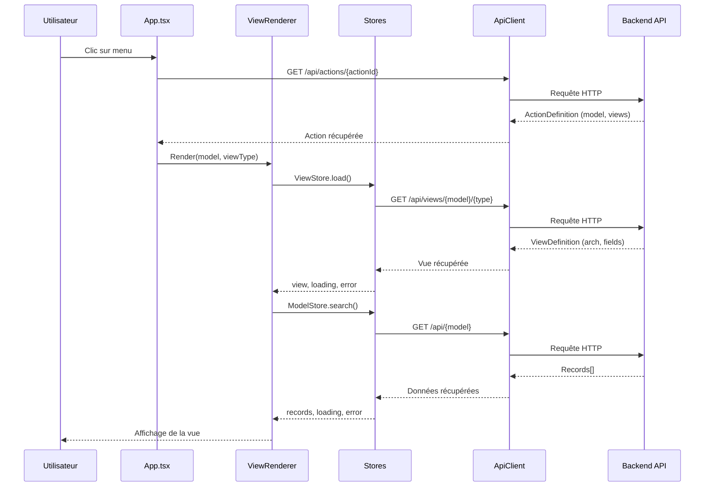

# Client React - My ERP

Ce document décrit l'architecture du client React qui permet d'afficher dynamiquement les vues définies par les modules backend.

## Architecture générale

```
core/client/
├── api/                    # Couche d'abstraction API
│   ├── client.ts           # Client HTTP (fetch)
│   ├── mock.ts             # Client mock pour tests
│   ├── types.ts            # Types et interfaces
│   └── index.ts
├── stores/                 # Gestion d'état (pattern Store)
│   ├── base.ts             # Classe Store de base
│   ├── model.ts            # ModelStore (CRUD)
│   ├── view.ts             # ViewStore, ActionStore, MenuStore
│   ├── useStore.ts         # Hook React bridge
│   └── index.ts
├── engine/                 # Moteur de rendu des vues
│   ├── ViewRenderer.tsx    # Point d'entrée du rendu
│   ├── hooks/              # Hooks React
│   ├── views/              # Composants de vues (List, Form, Grid)
│   ├── fields/             # Renderers de champs
│   └── components/         # Composants utilitaires
├── components/             # Composants UI de l'application
│   ├── App.tsx             # Composant racine
│   └── layout/             # Layout (Header, Sidebar, MainContent)
└── index.tsx               # Point d'entrée React
```

## Flux de données : Affichage d'une page

Le diagramme suivant illustre les échanges entre le client et le backend lorsqu'un utilisateur navigue vers une vue.



### Étapes détaillées

1. **Navigation** : L'utilisateur clique sur un menu, ce qui déclenche le chargement de l'action associée
2. **Chargement de l'action** : L'action définit le modèle cible et les vues disponibles
3. **Chargement de la vue** : Le `ViewRenderer` charge la définition de vue (structure `arch`)
4. **Chargement des données** : Les enregistrements sont récupérés via l'API REST
5. **Rendu** : Le composant de vue approprié (ListView, FormView) rend les données

## Couche API (`api/`)

### ApiClient Interface

L'interface `ApiClient` définit toutes les opérations disponibles, permettant l'injection de dépendances pour les tests.

```typescript
interface ApiClient {
  // CRUD modèle
  search<T>(model: string, domain?: Domain, options?: SearchOptions): Promise<SearchResult<T>>;
  read<T>(model: string, id: number): Promise<T>;
  create<T>(model: string, data: Partial<T>): Promise<T>;
  update<T>(model: string, id: number, data: Partial<T>): Promise<T>;
  delete(model: string, id: number): Promise<void>;
  execute<T>(model: string, id: number, action: string, params?: Record<string, unknown>): Promise<T>;

  // Métadonnées
  getFields(model: string): Promise<FieldsCollection>;
  getDefaults(model: string): Promise<Record<string, unknown>>;

  // Vues et menus
  getView(model: string, type: string): Promise<ViewDefinition>;
  getAction(actionId: string): Promise<ActionDefinition>;
  getMenus(): Promise<MenuItem[]>;

  // Upload
  uploadFile(file: File): Promise<string>;
  uploadFiles(files: File[]): Promise<string[]>;
}
```

### Implémentations

- **FetchApiClient** (`client.ts`) : Client HTTP utilisant `fetch()` pour la production
- **MockApiClient** (`mock.ts`) : Client simulé pour les tests unitaires

### Conversion des noms de modèles

Les noms de modèles utilisent des points (`sale.order`) mais sont convertis en slashes pour les URLs (`/api/sale/order`).

```typescript
function modelToPath(model: string): string {
  return model.replace(/\./g, '/');
}
```

## Stores (`stores/`)

Les stores gèrent l'état de l'application avec un pattern observable compatible avec React `useSyncExternalStore`.

### Store de base

```typescript
abstract class Store<TState> {
  subscribe(listener: () => void): () => void;  // Abonnement aux changements
  getSnapshot(): TState;                         // État actuel (immutable)
  protected setState(updater: Partial<TState>): void;  // Mise à jour + notification
}
```

### ModelStore

Gère les données CRUD d'un modèle ORM.

```typescript
const store = new ModelStore(apiClient, 'res.partner');

// Opérations disponibles
await store.loadFields();           // Charger les métadonnées
await store.search(domain, options); // Rechercher des enregistrements
await store.loadRecord(id);         // Charger un enregistrement
await store.create(values);         // Créer
await store.save(values, id?);      // Mettre à jour ou créer
await store.remove(id?);            // Supprimer
await store.execute(action, params); // Exécuter une action métier
```

### ViewStore, ActionStore, MenuStore

```typescript
// Charger une définition de vue
const viewStore = new ViewStore(api, 'sale.order', 'form');
await viewStore.load();

// Charger une action
const actionStore = new ActionStore(api);
await actionStore.load('action_sale_orders');

// Charger les menus
const menuStore = new MenuStore(api);
await menuStore.load();
```

### Hook useStore

Bridge entre les stores et React utilisant `useSyncExternalStore`.

```typescript
// S'abonner à tout l'état
const state = useStore(modelStore);

// S'abonner à une partie de l'état (optimisé)
const records = useStoreSelector(modelStore, (state) => state.records);

// Créer une instance mémoïsée
const store = useStoreInstance(() => new ModelStore(api, model), [api, model]);
```

## Moteur de rendu (`engine/`)

### ViewRenderer

Point d'entrée principal qui orchestre le chargement et le rendu des vues.

```typescript
<ViewRenderer
  model="sale.order"
  viewType="list"
  recordId={null}
  defaults={undefined}
  onNavigate={(params) => { /* navigation */ }}
/>
```

Le `ViewRenderer` :
1. Utilise `useView()` pour charger la définition de vue
2. Sélectionne le composant approprié (`ListView`, `FormView`, etc.)
3. Passe les props nécessaires au composant de vue

### Types de vues

| Type | Composant | Description |
|------|-----------|-------------|
| `list` | `ListView` | Tableau avec pagination |
| `form` | `FormView` | Formulaire d'édition |
| `grid` | `TimesheetGridView` | Grille spécialisée (feuilles de temps) |

### Hooks disponibles

```typescript
// Charger une définition de vue
const { view, loading, error } = useView('sale.order', 'form');

// Charger une action
const { action, loading, error } = useAction('action_sale_orders');

// Charger les menus
const { menus, loading, error } = useMenus();
```

### Renderers de champs (`fields/`)

Chaque type de champ a son propre renderer :

| Fichier | Types de champs |
|---------|-----------------|
| `TextField.tsx` | string, text |
| `NumberField.tsx` | integer, float, monetary |
| `BooleanField.tsx` | boolean |
| `DateField.tsx` | date, datetime |
| `SelectionField.tsx` | selection |
| `Many2OneField.tsx` | many2one |
| `ImageField.tsx` | image, json (pour URLs) |
| `FieldRenderer.tsx` | Dispatcher principal |

## Composants de vues (`engine/views/`)

### ListView

Affiche les enregistrements dans un tableau.

Structure des composants :
- `ListHeader.tsx` : Titre et bouton "Nouveau"
- `ListTable.tsx` : Tableau des enregistrements
- `ListFooter.tsx` : Pagination

### FormView

Formulaire pour créer/éditer un enregistrement.

Structure des composants :
- `FormHeader.tsx` : Boutons d'action et statusbar
- `FormSheet.tsx` : Corps du formulaire avec groupes et notebook
- `FormGroup.tsx` : Groupe de champs avec label
- `Notebook.tsx` : Onglets
- `StatusBar.tsx` : Barre d'état
- `One2ManyField.tsx` : Champ relationnel avec liste imbriquée
- `FormFooter.tsx` : Pied de page avec champs calculés

## Application (`components/`)

### App.tsx

Composant racine qui :
- Charge les menus via `useMenus()`
- Gère l'état de navigation (`currentView`)
- Synchronise l'URL avec l'état (history API)
- Compose les composants de layout

### Layout

- `AppHeader.tsx` : En-tête avec logo
- `Sidebar.tsx` : Menu latéral avec arborescence
- `MainContent.tsx` : Zone principale qui rend le `ViewRenderer`
- `MenuTree.tsx` : Composant récursif pour l'arbre des menus

## Testabilité

L'architecture permet une testabilité complète grâce à :

1. **Injection de dépendances** : Les stores acceptent un `ApiClient` en paramètre
2. **MockApiClient** : Simule les réponses API pour les tests
3. **Stores isolés** : Logique métier séparée des composants React

```typescript
// Test d'un store
import { MockApiClient } from '../api/mock';
import { ModelStore } from './model';

const mockApi = new MockApiClient({
  'res.partner': [
    { id: 1, name: 'Partner 1' },
    { id: 2, name: 'Partner 2' },
  ],
});

const store = new ModelStore(mockApi, 'res.partner');
await store.search();
expect(store.getSnapshot().records).toHaveLength(2);
```

## Points d'extension

### Ajouter un nouveau type de vue

1. Créer le composant dans `engine/views/`
2. L'enregistrer dans `viewComponents` de `ViewRenderer.tsx`

```typescript
const viewComponents: ViewComponents = {
  form: FormView,
  list: ListView,
  kanban: KanbanView,  // Nouveau
};
```

### Ajouter un nouveau type de champ

1. Créer le composant dans `engine/fields/`
2. L'ajouter au switch de `FieldRenderer.tsx`

```typescript
switch (fieldDef.type) {
  case 'rating':  // Nouveau
    return <RatingField {...props} />;
}
```

## Configuration

Le client est construit avec Vite. Configuration dans `vite.config.ts`.

```bash
# Développement
pnpm client:dev     # Lance le serveur de dev sur :3000

# Production
pnpm client:build   # Build dans dist/client
```
