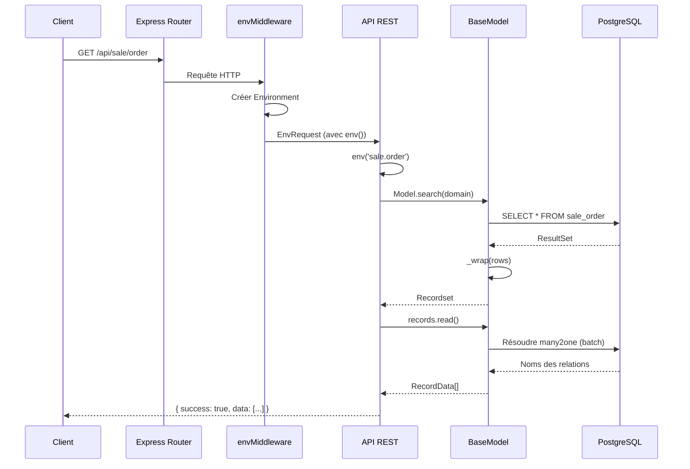
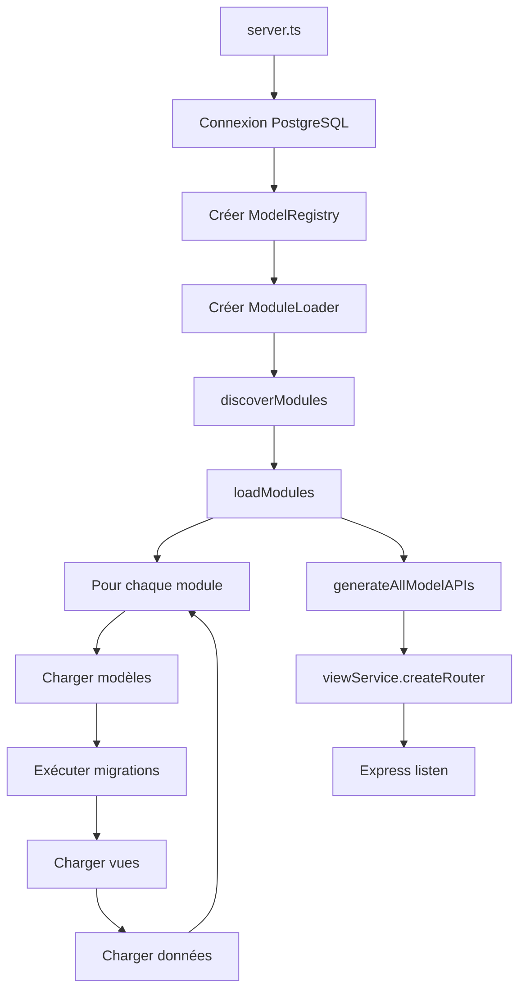

# Backend Server - My ERP

Ce document décrit l'architecture du serveur Node.js/TypeScript qui gère l'ORM, les API REST et le chargement des modules.

## Architecture générale

```
core/server/
├── orm/                    # ORM inspiré d'Odoo
│   ├── BaseModel.ts        # Classe de base des modèles
│   ├── ModelRegistry.ts    # Registre et compilation des modèles
│   ├── fields.ts           # Types de champs et conversions SQL
│   ├── types.ts            # Interfaces TypeScript
│   └── guards.ts           # Type guards et validation
├── api/                    # API REST auto-générée
│   ├── rest.ts             # Routes CRUD pour les modèles
│   ├── views.ts            # Service des vues/actions/menus
│   ├── upload.ts           # Upload de fichiers
│   └── index.ts
├── module-loader/          # Chargement des addons
│   ├── index.ts            # ModuleLoader principal
│   └── graph.ts            # Tri topologique des dépendances
└── services/               # Services transversaux
    ├── Environment.ts      # Contexte d'exécution
    ├── PoolQueryable.ts    # Abstraction PostgreSQL
    └── index.ts
```

## Flux de traitement d'une requête



## ORM (`orm/`)

L'ORM est documenté en détail dans **[orm/README.md](./orm/README.md)**.

En résumé, il offre :
- **BaseModel** : Classe de base avec CRUD (search, browse, create, write, unlink, read)
- **ModelRegistry** : Enregistrement et extension des modèles (pattern `_inherit` d'Odoo)
- **Types de champs** : integer, float, monetary, string, text, boolean, date, datetime, selection, many2one, one2many, many2many, json, image
- **Domaines de recherche** : Syntaxe `[['field', 'operator', 'value'], ...]`
- **Champs calculés** : Option `compute` pour les champs dynamiques

## API REST (`api/`)

### Routes auto-générées

Pour chaque modèle, les routes suivantes sont créées automatiquement :

| Méthode | Route | Description |
|---------|-------|-------------|
| GET | `/api/{model}` | Liste avec filtrage |
| GET | `/api/{model}/count` | Compte les enregistrements |
| GET | `/api/{model}/defaults` | Valeurs par défaut |
| GET | `/api/{model}/:id` | Lecture d'un enregistrement |
| POST | `/api/{model}` | Création |
| PUT | `/api/{model}/:id` | Mise à jour |
| DELETE | `/api/{model}/:id` | Suppression |
| POST | `/api/{model}/:id/action/:name` | Exécution d'une action |

**Note** : Les noms de modèles avec des points (`sale.order`) sont convertis en slashes (`/api/sale/order`).

### Paramètres de recherche

```
GET /api/sale/order?domain=[["state","=","draft"]]&limit=10&offset=0&order=create_date DESC
```

| Paramètre | Description |
|-----------|-------------|
| `domain` | Filtre JSON (format Odoo) |
| `limit` | Nombre max de résultats |
| `offset` | Décalage pour pagination |
| `order` | Tri (ex: "name ASC") |
| `fields` | Champs à retourner (comma-separated) |

### Format de réponse

```json
{
  "success": true,
  "data": [{ "id": 1, "name": "SO001" }],
  "count": 42
}
```

En cas d'erreur :

```json
{
  "success": false,
  "error": "Record not found"
}
```

### ViewService

Gère les définitions de vues, actions et menus.

```typescript
const viewService = new ViewService();

// Enregistrer les vues d'un module
viewService.registerViews(viewDefinitions);

// Récupérer une vue
const view = viewService.getViewForModel('sale.order', 'form');

// Récupérer l'arbre des menus
const menus = viewService.getMenus();
```

Routes exposées :
- `GET /api/views` : Liste toutes les vues
- `GET /api/views/{model}/{type}` : Vue spécifique
- `GET /api/actions/:id` : Définition d'action
- `GET /api/menus` : Arbre des menus

## Module Loader (`module-loader/`)

### Découverte et chargement

Le `ModuleLoader` gère le cycle de vie des addons :

```typescript
const loader = new ModuleLoader('./addons', {
  registry,
  pool,
  app,
});

// 1. Découvrir les modules disponibles
loader.discoverModules();

// 2. Charger les modules demandés (résolution auto des dépendances)
await loader.loadModules(['base', 'sales', 'project']);
```

### Ordre de chargement

Pour chaque module :

1. **Modèles** : Fichiers dans `models/*.ts` → `registry.define()` ou `registry.extend()`
2. **Routes** : Fichiers dans `routes/*.ts` → `app.use()`
3. **Vues** : Fichiers JSON dans `views/*.json` → `viewService.registerViews()`
4. **Migrations** : Fichiers dans `migrations/*.js` → `migration.up(pool)`
5. **Données** : Fichiers dans `data/*.json` → INSERT dans les tables

### Résolution des dépendances

Les modules sont triés topologiquement selon leurs dépendances :

```
base → sales → project → timesheet
```

Si `sales` dépend de `base`, `base` sera toujours chargé en premier.

### Structure d'un manifest.json

```json
{
  "name": "sales",
  "version": "1.0.0",
  "label": "Ventes",
  "depends": ["base"],
  "models": ["models/*.js"],
  "views": ["views/*.json"],
  "migrations": ["migrations/*.js"],
  "data": ["data/init.json"]
}
```

## Services (`services/`)

### Environment

Contexte d'exécution qui fournit l'accès aux modèles et à la base de données.

```typescript
const env = new Environment({
  pool: poolQueryable,
  registry: modelRegistry,
  user: currentUser,
  context: { lang: 'fr_FR' },
});

// Accéder à un modèle
const Partner = env.model('res.partner');
const partners = await Partner.search([['is_company', '=', true]]);

// Créer un environnement avec un contexte différent
const envFR = env.withContext({ lang: 'fr_FR' });

// Exécuter dans une transaction
await env.transaction(async (txEnv) => {
  const order = await txEnv.model('sale.order').create({ ... });
  await txEnv.model('sale.order.line').create({ order_id: order.id, ... });
});
```

### envMiddleware

Middleware Express qui injecte l'environnement dans chaque requête.

```typescript
app.use(envMiddleware(pool, registry));

// Dans un handler
app.get('/api/custom', (req: EnvRequest, res) => {
  const Partner = req.env('res.partner');
  // ...
});
```

### PoolQueryable

Abstraction de `pg.Pool` pour faciliter les tests et les transactions.

```typescript
interface Queryable {
  query<T>(sql: string, params?: unknown[]): Promise<QueryResult<T>>;
}
```

## Séquence de démarrage



## Points d'extension

### Ajouter un nouveau type de champ

1. Définir dans `fields.ts` :

```typescript
export const fieldTypes: FieldTypeMap = {
  // ...
  rating: {
    sqlType: 'INTEGER',
    isVirtual: false,
    toSQL: (value) => Math.round(value * 100),
    fromSQL: (value) => value / 100,
  },
};
```

### Ajouter une route personnalisée

Dans un addon, créer `routes/custom.ts` :

```typescript
export default function customRoutes(app: Express) {
  app.get('/api/custom/endpoint', (req: EnvRequest, res) => {
    const Model = req.env('my.model');
    // ...
  });
}
```

### Surcharger une méthode de modèle

Utiliser `registry.extend()` pour ajouter ou modifier le comportement :

```typescript
registry.extend({
  inherit: 'sale.order',
  methods: {
    async actionConfirm() {
      // Appeler la méthode originale
      const result = await this._super?.();

      // Logique additionnelle
      await this.env.model('mail.message').create({
        body: 'Commande confirmée !',
      });

      return result;
    },
  },
});
```

## Tests

Les tests utilisent Vitest avec des helpers dans `core/test-helpers/`.

```typescript
import { createTestEnv } from '@core/test-helpers/test-env';
import { createMockPool } from '@core/test-helpers/mock-pool';

describe('SaleOrder', () => {
  it('should confirm order', async () => {
    const { env } = await createTestEnv();
    const Order = env.model('sale.order');

    const order = await Order.create({ name: 'SO001', state: 'draft' });
    await order.actionConfirm();

    const data = await order.read(['state']);
    expect(data[0].state).toBe('sale');
  });
});
```

## Configuration

Configuration dans `config/default.json` :

```json
{
  "server": {
    "port": 8069,
    "host": "localhost"
  },
  "database": {
    "host": "localhost",
    "port": 5432,
    "database": "my_erp",
    "user": "postgres",
    "password": "postgres"
  },
  "addons_path": ["./addons"],
  "modules": ["base", "sales", "project", "timesheet"]
}
```
